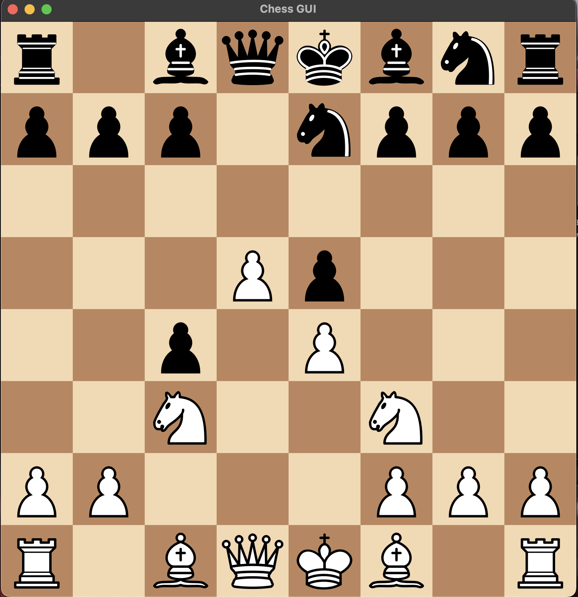

# Chess GUI — Python + C++ Hybrid (Engine Coming Soon)

This project is an experimental **Chess Application** built with a **Python frontend** and an upcoming **C++ backend engine**.  
Currently, there is **no integrated C++ chess engine**, and the game logic is handled temporarily by the `python-chess` library.  

A **custom C++ chess engine** is planned and will be integrated soon using **Pybind11** to bridge Python (frontend) with native C++ backend logic.

---

## 🖼 Application Preview

### Preview 1


### Preview 2



## 🧩 Project Architecture (Planned)

| Layer | Language | Description |
|-------|----------|-------------|
| GUI Frontend | **Python (PyQt6)** | Renders the board & handles user interaction |
| Game Logic / AI Engine | **C++** | Will perform move generation, evaluation & search |
| Binding Layer | **Pybind11** | Connects C++ engine to Python Python interface |

---

## ⏳ Current Status

✔ Chess GUI Drag-and-Drop Board  
✔ Legal moves (using python-chess library)  
✖ **C++ engine not implemented yet**  
✖ Pybind11 integration not active yet  

---

## 📦 Required Libraries / Dependencies

The following Python libraries are required:

| Library | Purpose |
|--------|---------|
| `python-chess` | Board representation & rules (temporary engine) |
| `PyQt6` | Windowing & rendering |
| `PyQt6-Svg` or included SVG support | Renders piece SVGs |

Install using:

```bash
pip install python-chess PyQt6
````

#### System Dependencies (Upcoming)

Once the C++ backend is added, the project will additionally require:

| Library               | Purpose                           |
| --------------------- | --------------------------------- |
| **C++17/20 compiler** | To build the backend engine       |
| **Pybind11**          | Python <-> C++ binding            |
| **CMake**             | Build configuration & compilation |

#### Example installation for Pybind11 (future):

```bash
pip install pybind11
```

---

## 🖼 Assets (Piece SVGs)

The application expects SVG chess piece images located in:

```
./pieces/
```

File naming format:

```
wK.svg, bQ.svg, wP.svg ... etc.
```

---

## 🛠 Running the Application

```bash
python main.py
```

---

## 🚀 Future Roadmap

* [ ] Implement full C++ chess engine
* [ ] Alpha-beta pruning & NNUE experiments
* [ ] Pybind11 binding
* [ ] Replace python-chess interim logic
* [ ] Add move annotations, PGN save/load
